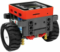
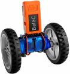
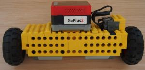
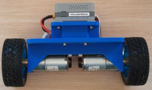
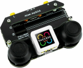
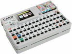

# Radio Controlled Self Balancing Robot Framework

This software forms a framework for a Radio Controlled Self Balancing Robot. It is designed to be configurable and to support a variety of motor types,
with and without encoders.

The radio control uses the ESP-NOW protocol.

Additionally there is a backchannel - this supports telemetry and also has a command interface to allow remote PID tuning.

## Current Implementations

There are four currently implementations:

1. one for the [M5Stack Bala2Fire](https://docs.m5stack.com/en/app/bala2fire),
2. one for the [M5Stack BalaC](https://docs.m5stack.com/en/app/balac_plus),
3. Lego version using 2 Power Functions XL Motors (8882) and the [M5Stack GoPlus2 Module](https://docs.m5stack.com/en/module/goplus2),
4. 3D printed version using JGA25_370 Metal Geared Motors with encoders and the [M5Stack 4EncoderMotor Module](https://docs.m5stack.com/en/module/Module_4EncoderMotor_V1.1).

PID tuning for the Lego version is currently stalled - I burnt out one of the motor drivers on the GoPlus2 module during PID tuning.

PID tuning for the JGA25_370 is currently stalled - I ordered the wrong the JGA25_370 motors for the 3D printed version, the ones I ordered
don't have enough torque, so I've ordered new motors (same motors with lower gearing).

These are controlled with the [M5Stack AtomJoyStick](https://shop.m5stack.com/products/atom-joystick-with-m5atoms3).

Telemetry and PID tuning is using the [M5Stack Cardputer](https://docs.m5stack.com/en/core/Cardputer)

## Modularity of Implementation

The Self Balancing Robot Framework is implemented in a modular way, with the different components split off into separate libraries.
These libraries are designed so they may be used in other projects.

| Library              | Function  | Location |
| -------------------- | --------- | -------- |
| IMU_TYPES            | General purpose 3D vector, quaternion, and 3x3 matrix classes |https://github.com/martinbudden/Library-IMU_TYPES|
| PIDF                 | PID controller with feed-forward | https://github.com/martinbudden/Library-PIDF |
| Filters              | Collection of general purpose filters | https://github.com/martinbudden/Library-Filters |
| AtomJoyStickReceiver | Receiver for M5Stack Atom Joystick | https://github.com/martinbudden/Library-AtomJoyStickReceiver |
| SensorFusion         | Sensor Fusion including  Complementary Filter  Mahony Filter  Madgwick Filter  VQF | https://github.com/martinbudden/Library-SensorFusion |

## Potential Future Implementations

This is more a list of ideas for possible future implementations rather than a plan to make those implementations. I might undertake some of these depending on
availability of time and hardware:

1. Hoverboard version using ODrive, ODesc, or Moteus drivers and probably the [M5 Stack PwrCAN Module](https://docs.m5stack.com/en/module/Module13.2-PwrCAN).
2. 3D printed version using NEMA17 stepper motors.
3. 3D printed version using [M5Stack RollerCAN Units](https://docs.m5stack.com/en/unit/Unit-RollerCAN) and [M5 Stack PwrCAN Module](https://docs.m5stack.com/en/module/Module13.2-PwrCAN).
4. Tiny version using Carl Bugeja's [Microbots CodeCell](https://microbots.io/products/codecell) and two
[Microbots DriveCell](https://microbots.io/products/drivecell) - how small can I make it?
5. Raspberry Pi Pico version. In particular I'd like to try and port the D-Shot ESC Protocol to the Raspberry Pi Pico Programmable I/O and use the Pico to control
   the motors. Since D-Shot is a bidirectional protocol it will be possible to obtain the motors' RPM and use that as part of the motor control loop. As I understand
   it, D-Shot only provides reliable motor RPM values for high RPM, but it might still be possible to use the values provided instead of using encoders. Something
   at least worth investigating.
6. Port to Raspberry Pi and use Raspberry Pi Lego hat to make a Lego version using PoweredUp motors (which have encoders built in).
7. Addition of wheels to the feet of Dan's [Modular Biped Robot](https://github.com/makerforgetech/modular-biped/wiki). The idea is they would be a bit like Heelys
   and allow the robot to lift itself onto it's heels and then propel itself.

## Articles/videos about Self Balancing Robots

[How to visually tune PID Control Loops](https://www.youtube.com/watch?v=-bQdrvSLqpg) - good explanation of how to do PID tuning.

[Building an Arduino-based self-balancing robot](https://roboticdreams.wordpress.com/2015/04/24/building-an-arduino-based-self-balancing-robot-part-1/).
Good explanation of all the ins and outs of self balancing robots, by Mike Jacobs.

## Other self balancing robots

[J Pieper's Hoverbot](https://jpieper.com/2024/06/06/hoverbot/)
uses hoverboard motors and moteus-c1 BLDC motor controllers.
Code runs on a Raspberry Pi.
Has an explanation of the build and the PID control system.

[Stijns Projects self balancing robot](https://stijnsprojects.github.io/Balancing-robot/)
uses hoverboard motors and ODrive/ODESC BLDC motor controllers.
Code runs on two Arduinos.
Has a good explanation of how to to set up ODrive.

[Lukas Kaul's version of the HoverBot](https://github.com/CharlestonRobotics/ChIMP)
uses hoverboard motors and ODrive BLDC motor controllers
Code runs on an Arduino.
Has a good explanation of the build.

[James Bruton's TallBalancer youtube video](https://www.youtube.com/watch?v=TN6u-D992sw)
uses Turnigy 6374 148 kV motors and ODrive BLDC motor controllers.
Code runs on a Teensy 3.6.
The code is [here](https://github.com/XRobots/TallBalancer/tree/main/Code)

[Noah Zipin's self balancing robot](https://www.youtube.com/watch?v=M7D-TyRbdDE)
uses Pololu 156:1 Metal Gearmotors (20Dx44L mm 12V CB with Extended Motor Shaft and Hall effect encoders) and L298N (H-bridge) motor controllers.
The code runs on an Arduino.
The code is [here](https://github.com/nzipin/Self-Balancing-Robot)

[Your Arduino Balancing Robot](http://www.brokking.net/yabr_main.html)
uses NEMA-17 stepper motors.
The code runs on an Arduino.
Good overall explanation.

[Arduino SimpleFOCBalancer](https://github.com/simplefoc/Arduino-FOC-balancer) - Modular Arduino two wheel balancing robot.
Uses 4108 gimbal BLDC motors with AMT103 CUI encoders.
Motors controlled by an [Arduino SimpleFOCShield](https://docs.simplefoc.com/arduino_simplefoc_shield_showcase)
and the [SimpleFOClibrary](https://docs.simplefoc.com/arduino_simplefoc_library_showcase).
Good explanation of the build and overview of the control algorithm.
